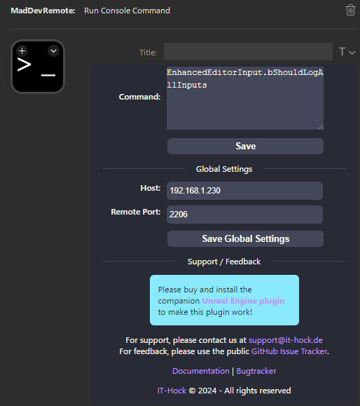

  
  <h1>MadDev Remote</h1>
  
  

    MadDev Remote is a paid plugin for the Unreal Engine to enable communication between Unreal Engine and the Elgato Stream Deck.
    This is achieved through a custom (free) plugin for the Stream Deck and a (paid) plugin for the Unreal Engine.
  

    
    

    
    

   
<h4>
    <a href="https://github.com/IT-Hock/MadDevRemote">Documentation</a>
   · 
    <a href="https://github.com/IT-Hock/MadDevRemote/issues/">Report Bug</a>
   · 
    <a href="https://github.com/IT-Hock/MadDevRemote/issues/">Request Feature</a>
  </h4>

 

# :notebook_with_decorative_cover: Table of Contents

- [About the Project](#star2-about-the-project)
  - [Installation](#gear-installation)
- [Usage](#eyes-usage)
- [Roadmap](#compass-roadmap)
- [Contact](#handshake-contact)

## :star2: About the Project

### :warning: Stream Deck Plugin is useless without the Unreal Engine Plugin :warning:
> :warning: Please note that the Unreal Engine Plugin is a paid plugin and can be purchased from the [Unreal Engine Marketplace](https://www.unrealengine.com/marketplace/en-US/product/maddevremote).
### :warning: Stream Deck Plugin is useless without the Unreal Engine Plugin :warning:

 
  

## :gear: Installation

### :warning: Stream Deck Plugin is useless without the Unreal Engine Plugin :warning:
> :warning: Please note that the Unreal Engine Plugin is a paid plugin and can be purchased from the [Unreal Engine Marketplace](https://www.unrealengine.com/marketplace/en-US/product/maddevremote).
### :warning: Stream Deck Plugin is useless without the Unreal Engine Plugin :warning:

- **Step 1:** Download the Stream Deck Plugin
  - Download the latest version of the Stream Deck Plugin from the [releases page](https://github.com/IT-Hock/MadDevRemote/releases/latest/download/de.ithock.maddevremote.streamDeckPlugin).
- **Step 2:** Install the Stream Deck Plugin
  - Open the Stream Deck application and double-click the downloaded plugin file.
- **Step 3:** Install the Unreal Engine Plugin
  - Download the Unreal Engine Plugin from the [Unreal Engine Marketplace](https://www.unrealengine.com/marketplace/en-US/product/maddevremote).
- **Step 4:** Enable the Unreal Engine Plugin
    - Open your Unreal Engine project and enable the plugin in the plugin manager.
    - Restart the Unreal Engine Editor.
- **Step 5:** Create a "Run Console Command" Action
  - Add a new action to your Stream Deck profile.
  - Select the "Run Console Command" action.
  - Enter the command you want to execute in the Unreal Engine.

## :eyes: Usage

The stream deck plugin adds a new action called "Run Console Command". This action allows you to execute any console command in the Unreal Engine.

## :compass: Roadmap

Please have a look at the [open issues](https://github.com/IT-Hock/MadDevRemote/issues/) for a list of proposed features (and known issues).

## :handshake: Contact

- General Support: support@it-hock.de
- Dominic Hock - d.hock@it-hock.de

Project Link: [https://github.com/IT-Hock/MadDevRemote](https://github.com/IT-Hock/MadDevRemote)

## :gem: Acknowledgements

Use this section to mention useful resources and libraries that you have used in your projects.

- [Shields.io](https://shields.io/)
- [Awesome README](https://github.com/matiassingers/awesome-readme)
- [Elgato Stream Deck](https://www.elgato.com/en/gaming/stream-deck)
- [Unreal Engine](https://www.unrealengine.com/)
